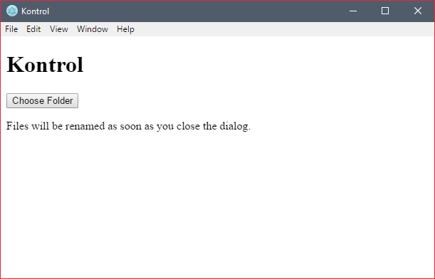

# Kontrol

App that helps you organize your media files.

Learn more about the app on the official web page: [https://sondreb.github.io/Kontrol/](https://sondreb.github.io/Kontrol/)

Currently the app does only support renaming of .mp4 and .mov files, there are no support for renaming images yet. Until image rename support is added, please refer to [Namexif](http://www.digicamsoft.com/softnamexif.html).

Kontrol process for finding video creation date:

1. Read EXIF metadata.
2. Find date in this order: createDate, mediaCreateDate, trackCreateDate.
3. If date is not found in the EXIF, reads metadata from file system ("mtime").

Currently the app does not support custom filename formats, and defaults to the following example:

2015-10-31-16h06m12.mp4


## Setup of source and building the app

```
git clone https://github.com/sondreb/Kontrol.git
```

Navigate into the "Kontrol" folder on your computer.

```
npm install
npm start
```

This will first install all the dependencies, and then launch the app.


## Dependencies

- Kontrol relies on [ExifTool](http://owl.phy.queensu.ca/~phil/exiftool/) (supplied in the repo) to read EXIF data from media files.
- [Node.js](https://nodejs.org/)


## Supported platforms

Kontrol supports only Windows at the moment, but support for Linux and OS X is planned in the future.

## Disclaimer

Any operations on the file system is prone to problems. Using Kontrol is done under
no warranty. Make sure you take backups before using Kontrol. While great care is taken to avoid problems, you are using the app under your own risk.

## Screenshots

### Version 0.1



## License
    
MIT © [Sondre Bjellås](http://sondreb.com)
